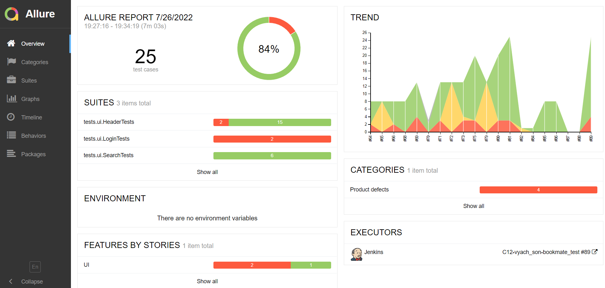
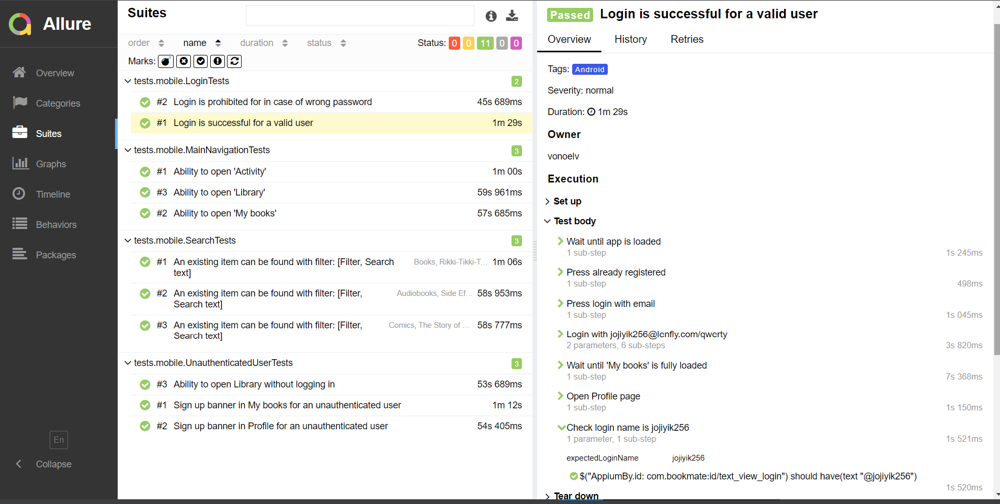

###

<h1 align="center">Привет👋 Меня зовут Глеб!</h1>

###

  

    
    
  

###

<h3 align="left">🙂 Обо мне</h3>

###

  Глеб, 27 лет. QA Automation Engineer Java с более чем 2-летним опытом разработки и
поддержки автоматизированных тестов для веб-приложений (UI и API) на стеке: Java, JUnit 5,
Selenide, RestAssured, Jenkins, Allure. Успешно интегрирую тесты в CI/CD процессы,
обеспечивая стабильность и качество продукта на всех этапах разработки. Так же имею
опыт ручного тестирования. Постоянно развиваюсь в сфере IT, увлечен технологиями и
поиском эффективных решений. Нахожусь в поиске нового интересного проекта, где смогу
применить свои навыки и внести вклад в развитие продукта! 
  
###

<h3 align="left">🛠 Технологии автотестирования:</h3>

  <code></code>
  <code></code>
  <code></code>
  <code></code>
  <code></code>
  <code></code>
  <code></code>
  <code></code>
  <code></code>
  <code></code>
  <code></code>
  <code></code>
  <code></code>
  <code></code>

# <a name="AllureReport">Отчет о результатах тестов в Allure Report</a>

## Main page
Создание профессиональных Allure-отчетов позволяет бизнесу получать наглядную визуализацию качества продукта и эффективности тестирования, что значительно повышает доверие к выпускаемым версиям.

Список тестов, сгруппированных по сьютам, с отображением статуса каждого теста. \
Для каждого теста доступна полная информация: теги, приоритет, уровень серьезности, длительность, детальные шаги выполнения.

А так же дополнительные артефакты:
>- Скриншоты ошибок в UI тестах 🖼️
>- Видео выполнения тестов UI тестов 🎥
>- Отправка результатов в Telegram 📱
>- Экспорт результатов HTML, XML, JSON 💻

  
  

